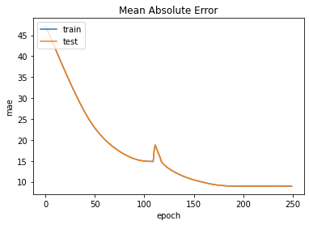

# **Facial Key Point Detection**

## ***Problem Definition***
Facial Key Point Detection is a computer vision problem. In this problem, the coordinates of the key points should be predicted by considering the facial features.

## ***Solution***
### ***Architectures*** 
In order to do this task, different models can be used. However, as the features are needed to do the task, CNNs should be utilized to extract the features. Therefore, my first implemented models are simple CNNs.I have also checked some related papers. Most of the works (that I have seen) use CNNs for feature extraction and they use some FC layers to predict the final points. (E.g., [Colaco and Han, 2020],[Longpre and Sohmshetty, 2016]) In this project, LSTM layers have also been used in some models.

### ***Loss Function*** 
Choosing the right loss function is one of the most important decisions in these models. As the points are some float numbers, the task is a kind of regression problem. Two different regression losses have been used in this regard. However, the results were not acceptable as the models were too weak. Therefore, I tried to check which loss has been used in other works. According to a paper \cite{longpre2016facial} which has been published in Stanford, the loss function should be as follow:

Therefore, I utilized this loss function to train my models. (Helpful source in this regard: https://stackoverflow.com/questions/43855162/rmse-rmsle-loss-function-in-keras/43863854})

## ***Experiment***

### ***Data*** 
The input to the model is a picture in a size of $96\times 96$.
And the output is a vector in size of thirty. This vector is consists of the coordinates of fifteen points.

### ***Model*** 
Different models have been implemented. The table below corresponds to my best model.

|Layer | Name            | Size         |
| -----| ----------------|--------------|
|0     | input\_layer    | (96, 96, 1)  |
|1     | Conv2D          | (96, 96, 64) |
|2     | MaxPooling2D    | (96, 96, 64) |
|3     | Conv2D          | (96, 96, 32) |
|4     | MaxPooling2D    | (96, 96, 32) |
|4     | Conv2D          | (96, 96, 32  |
|5     | MaxPooling2D    | (96, 96, 32) |
|6     | Conv2D (Path1)  | (96, 96, 32) |
|7     | MaxPooling2D    | (96, 96, 32) |
|8     | GlobalMaxPool2D | 32           |
|9     | Conv2D (Path2)  | (96, 96, 32) |
|10    | MaxPooling2D    | (96, 96, 32) |
|11    | GlobalMaxPool2D | 32           |
|12    | Conv2D (Path3)  | (96, 96, 32) |
|13    | MaxPooling2D    | (96, 96, 32) |
|14    | GlobalMaxPool2D | 32           |
|15    | Concatenate     | 96           |
|16    | Reshape         | (12, 8)      |
|17    | LSTM            | (12, 30)     |
|18    | LSTM            | (12, 30)     |
|19    | LSTM            | (12, 30)     |
|20    | Dense           | 30           |

## ***Results***
Here is the visualization of some pictures. The points have been predicted by some of my implemented models. For each of the models below, the mean square error and the loss has been visualized.

Model 29:

  

Model 28:

     

Model 27:

     

Model 24:

     

## ***Conclusion***
In this project, I implemented thirty-one models for facial keypoint detection.  The four best of them have been shown in the report. The architecture of the best model (in my opinion) has been shown in the table.

## ***References***
[Colaco and Han, 2020] Colaco, S. and Han, D. S. (2020). Facial keypoint de-
tection with convolutional neural networks. In 2020 International Conference
on Artificial Intelligence in Information and Communication (ICAIIC), pages
671–674. IEEE.

[Longpre and Sohmshetty, 2016] Longpre, S. and Sohmshetty, A. (2016). Facial
keypoint detection.
