# **Minibatch GAN**

## ***Problem Definition***

Generative Adversarial Networks (GANs) are the networks that consist of two parts, Generator and Discriminator. The Generator is a model that maps the input noise to a sample. (e.g, random noise to a photo) And the discriminator model receives some samples as an input. The discriminator should output if the inputs are from the real data or they are generated by the generator? [Heaton, 2018]

The simple GAN model (the baseline of this project), can build a generator which can generate good samples. However, sometimes these generated samples (which can also be labeled as real in discriminator) are not the perfect result that we want. For example, one problem that can be seen while generating the images is Mode Collapse.

" One of the main failure modes for GAN is for the generator to collapse to a parameter setting where it always emits the same point.
When collapse to a single-mode is imminent, the gradient of the discriminator may point in similar directions for many similar points.  Because the discriminator processes each example independently, there is no coordination between its gradients, and thus no mechanism to tell the outputs of the generator to become more dissimilar to each other. Instead, all outputs race toward a single point that the discriminator currently believes is highly realistic. "[Salimans et al., 2016]

When the generator model only some parts or modes of the data distribution, we call the mode collapse has happened. [Arora et al., 2017][Dieng et al., 2019]

In other words, Mode collapse refers to a problem that the generator can not generate all the categories available in the dataset. For example, in the case of MNIST, it generates just one same number perfectly in a way that discriminator will give a real label to it. However, it can not generate all the numbers. This problem can happen when the items (different classes) in a dataset are too close to each other.

## ***Experiment***
In this section, the implementation will be explained. Different ideas have been implemented. However, the best idea has been explained in this part.

### ***Dataset***
Two datasets from Keras library have been used in this project.

- MNIST: This dataset consists of images of 10 digits. It can be used for classification. Actually, it has 10 classes of data.
- Cifar10: This dataset is consists of colorful images in 10 categories. These categories are airplanes, cars, birds, cats, deer, dogs, frogs, horses, ships, and trucks. [Cifar Dataset] 

### ***Method***

The goal is defining a new loss function which can help us to avoid mode collapse by maximizing the distance between the generated images. In this regard, I have implemented a functional model for the generator. My new model has two outputs. The first output is the generated image which is the input to the discriminator. The second output is a number which I called it the distance. This second output must help us to update the model's weights in a way that generates different images.

As the second output is a number, we can see the problem as a regression problem. This number should be far from the distance of the other generated data. Therefore, the real labels of this second output are as follow:

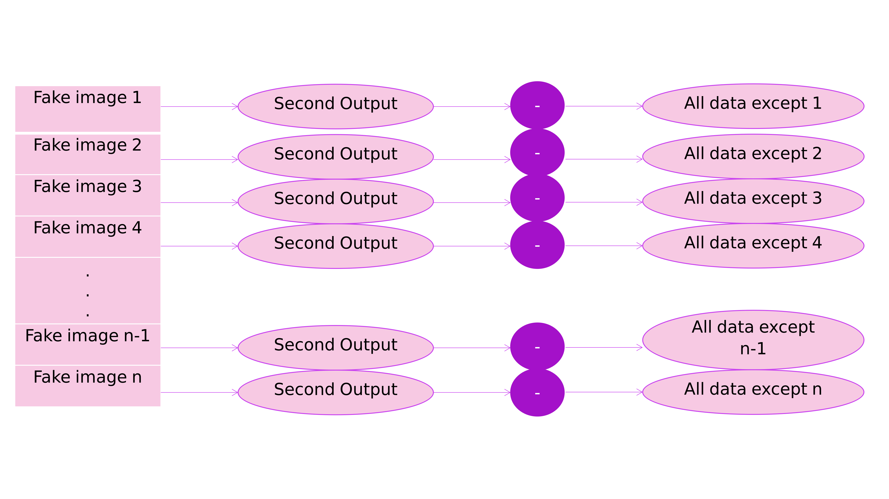

Fake images are a batch of images that have been generated by the generator. Each of these images has predicted value which I call it the distance. (Second output of the generator) This value should not be close to other images. Therefore, the norm of images inside a batch has been calculated as the label of the current output image. But the distance between the predicted value and this label should be maximized. 

To maximize this distance, I have defined a new loss function for the combined model. This loss function is the reverse of mean square error. Because we are going to maximize the distance by minimizing this new loss function. This new loss function for the second output could be any distance metric, here I tried to utilize mean square error.

# -----------------------------------------------------------
image

formula

\begin{equation}
New Loss \downarrow = \frac{1}{Mean Square Error \uparrow}
\end{equation}
 

## ***Results***
### ***Mnist***

First of all, I generated 48 photos by the generator. These are the results:

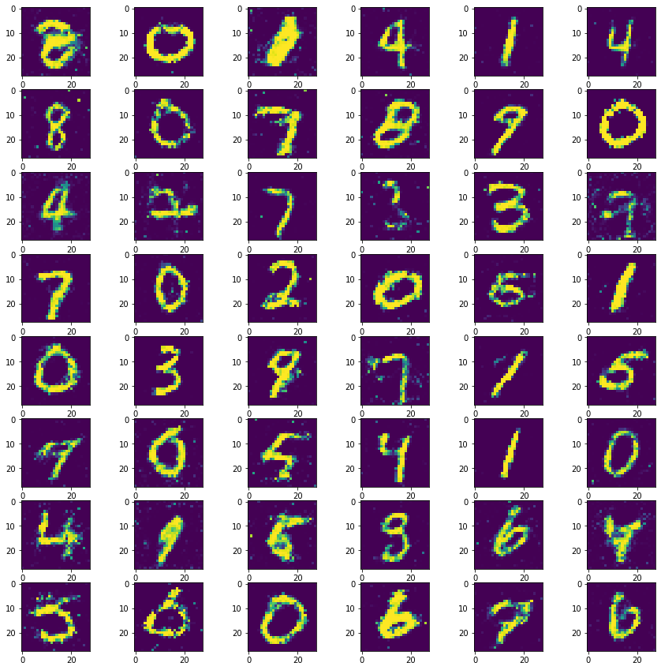

As you can see all the digits can be seen in these generated images. However, you can see number two once.

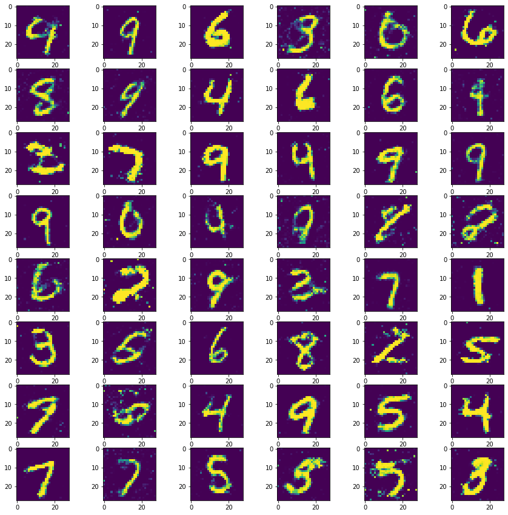

But here, there is no digit two in these generated images.
However, these results are generated from different random noise. It is not fair to compare the models with different noises. Therefore, I sampled some random noises and saved the noises to check the models with the same noises.(Noises has been attached with the code). You can see the result of the models for one of the same noises below:

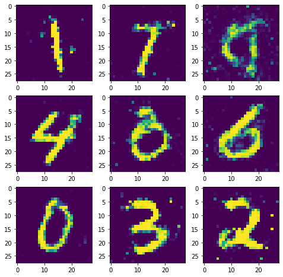

The digits are 1, 7, 4, 8 , 6 , 0, 0 , 3, 2. Only one repetition has happened.

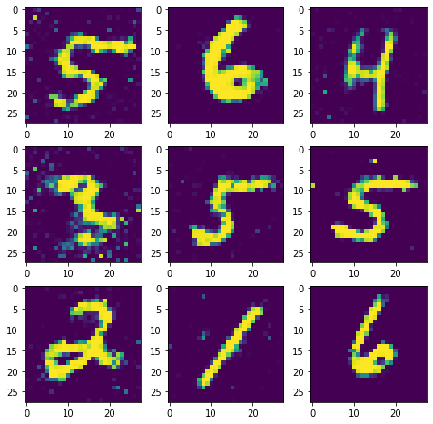

However, here the digits are 5, 5, 5, 6, 6, 4, 3, 2, 1. Two of the numbers have been repeated which is more than my model. 
Although my model does not generate the digits as well as the baseline model, it repeats the generated items less than the baseline model. Therefore, I think it has avoided mode collapse.
You can also check the below pictures which are generated by another noise.

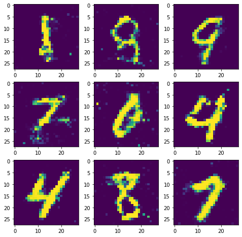

The digits are 1, 1, 8, 8, 9, 7, 0, 4, 4. The repeatition has happened more than the previus results. 

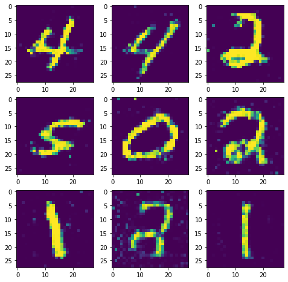

In baseline model the digits are 4, 4, 2, 2, 2, 5, 0, 1, 1.

As you can see, using different random noise which makes my model to generate more repeated digits, can have worth results in the baseline model. My model generated 6 different digits. However, the baseline model generated five different digits.

### ***Cifar10***
The baseline model with some simple changes has been used for training GAN on Cifar10. The generated photos for a simple baseline model in one thousand epochs was:

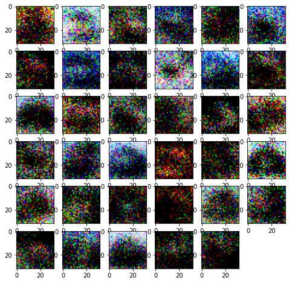

Nothing can be seen in this generated photos!

Therefore, I tried to change the baseline model. I added some convolutional layers in both generator and discriminator models.

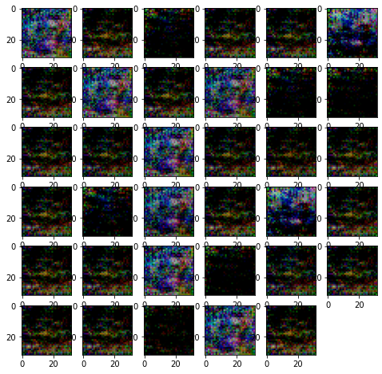

There was no such big difference in the results. Because we can not recognize any classes which are available in Cifar10! I am not sure, but I think It can be relevant to the preprocessing of the image data that has been used in the model. 

After training this baseline, I trained Cifar10 with the model that I used to avoid mode collapse on Mnist. You can see the generated images below.

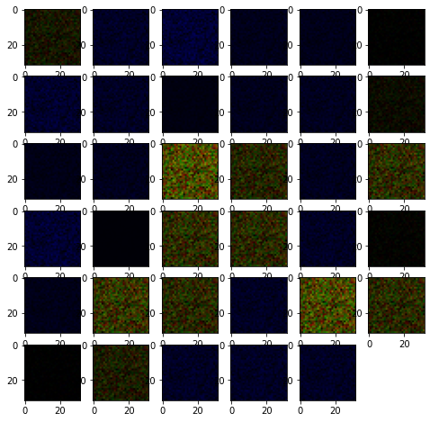

Both models are generating meaningless images. However, I noticed an interesting thing while using the same noise for both models.

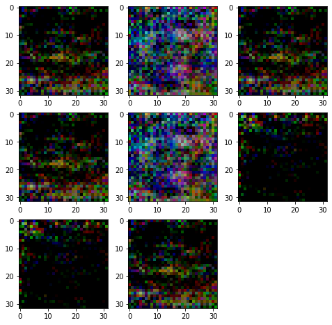

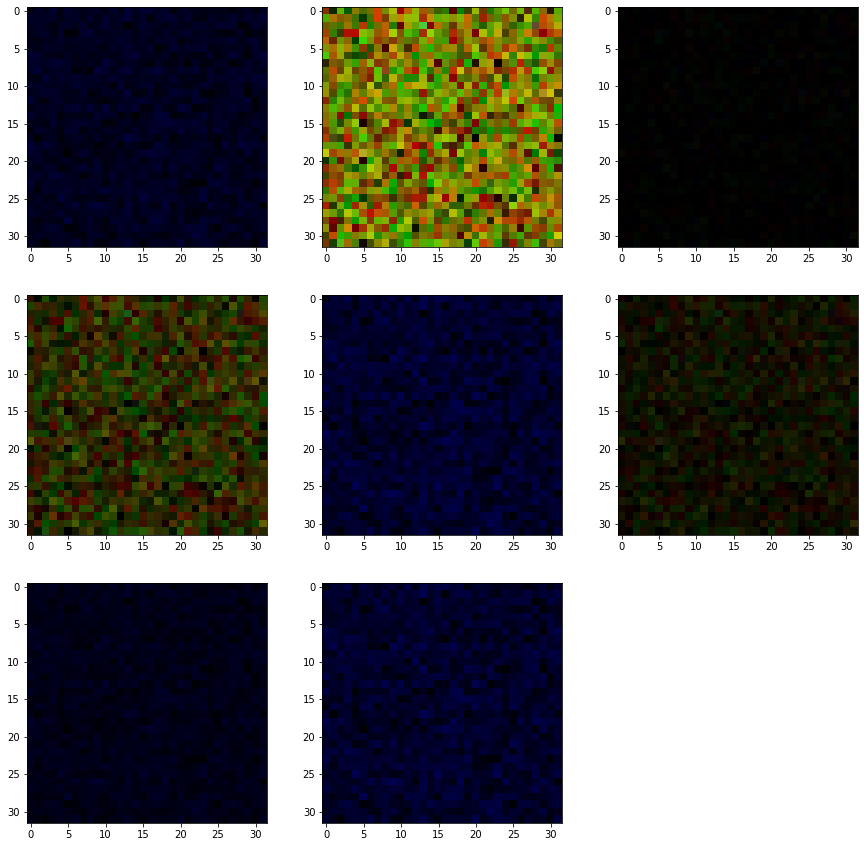

If you concentrate on these photos, you can see that: 

- Baseline model has generated three different images. Assume the label of them are A, B, C. Then you have four images in class A, two images in class B, and two images in class C.

- My model has generated six different images. Two of them are *dark blue*, two of them *light blue*, one of them is kind of *black*, one *yellow*, one *light yellow* and the last one is dark yellow!

Therefore, more different classes have been generated by my model.

## ***Conclusion***
In this project, a generator and combine model has been changed. Both of these models had one output in the baseline model. However, in my implementation, they have two outputs. A new loss function has been defined for the second output which aims to maximize the distance between the generated images. This new loss function is the reverse of mean square error.

## ***References***

[Arora et al., 2017] Arora, S., Ge, R., Liang, Y., Ma, T., and Zhang, Y. (2017).
Generalization and equilibrium in generative adversarial nets (gans). arXiv
preprint arXiv:1703.00573.

[Dieng et al., 2019] Dieng, A. B., Ruiz, F. J., Blei, D. M., and Titsias,
M. K. (2019). Prescribed generative adversarial networks. arXiv preprint
arXiv:1910.04302.

[Heaton, 2018] Heaton, J. (2018). Ian goodfellow, yoshua bengio, and aaron
courville: Deep learning.

[Salimans et al., 2016] Salimans, T., Goodfellow, I., Zaremba, W., Cheung, V.,
Radford, A., and Chen, X. (2016). Improved techniques for training gans. In
Advances in neural information processing systems, pages 2234–2242.

[Xiang and Li, 2017] Xiang, S. and Li, H. (2017). On the effects of batch
and weight normalization in generative adversarial networks. arXiv preprint
arXiv:1704.03971.

[Cifar Dataset] https://keras.io/api/datasets/cifar10/ , https://en.wikipedia.org/wiki/CIFAR-10

[Mnist Dataset] https://keras.io/api/datasets/mnist/
