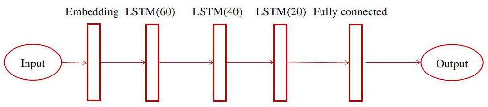

# **Sentiment Analysis**

## ***Problem Definition***

“Sentiment analysis (also known as opinion mining or emotion AI) refers to the use of natural language processing, text analysis, computational linguistics, and biometrics to systematically identify, extract, quantify, and study affective states and subjective information.” [1](https://en.wikipedia.org/wiki/Sentiment_analysis)
In this exercise, sentiment analysis is the problem that we are going to work on it. The dataset which is going to be used in this excercise is the IMDB dataset. IMDB is a large data set that includes movie reviews. [2](https://ai.stanford.edu/~amaas/data/sentiment/) Keras has IMDB dataset in its datasets. This dataset contains 25,000 movie reviews from IMDB which have been preprocessed and encoded into integers. Each sample has a sentiment label which can be positive or negative. [3](https://keras.io/api/datasets/imdb/)

## ***Deep Learning Model***
The goal is training a classifier that can categorize the reviews into two different
classes called negative and positive. As the data is text and it is time seri, we
can use LSTM layer in our model. After the LSTM layer, we should have fully
connected layer which will classify the reviews.

### ***Baseline Model***
The baseline model was a simple architecture which included one LSTM layer with seventy dimension hidden matrix. This model had an embedding layer for embedding the sequences. Then, it had an LSTM. Finally, it had a dense layer for classification. The activation function for this model was sigmoid.

### ***Other models***
The first important thing to do is deleting the stop words. In keras,the words have been added to the list by considering the frequencies. For example, the most frequent word in English is ”the” which has the index one in vocabulary.

How can we remove these frequent words? By skipping most frequent words using skip top argument!In this implimentation, I supposed that we have one hundred and twenty-seven stop words in this dataset. Therefore, I removed one hundred and twenty-seven frequent words in the vocab and replaced them with
zero. In building model, Two different strategies have been considered for training
other models. First, using stacked LSTM layers like the example below.

Second, using inception and concatenate the results of different stacked
LSTM layers.

The activation function has also been changed in some of the models.

## ***Results***
You can see different results for different models in below table.

|Model | SW | LSTM | S-LSTM | I-LSTM | NE | AF | Accuracy | Precision | Recall |
| --- | --- | --- | --- | --- | --- | --- | --- | --- | --- |
|Baseline | yes |  yes | no | no | 10 | sigmoid |  86.39 | 84.49 | 89.14 |
|Model1 | no| yes | no | no | 10 | sigmoid | 85.8 | - |- |
|Model2| no | no | yes | no | 1 | relu |  50.0 | - | - |
|Model2 | no | no | yes | no |  10 | relu |  50.0 | - | - |
|Model3 | no | no | yes | yes |  10 |softmax| 50.0 | 50.0 | 100.0 |
|Model3 | no | no | yes | yes |  10 | sigmoid| 82.88 | 83.50 | 81.94 |
|Model3 | no |no | yes | yes | 20 | sigmoid | 81.70 | 82.20 | 80.92|
|Model4 | no| no| yes | yes | 10 | sigmoid | 83.49 |82.46 | 85.08|

Where:
- SW: Have stop words
- LSTM: Simple LSTM
- I-LSTM: LSTM with Inception Module
- S-LSTM: Stacked LSTMs
- NE: Number of Epochs
- AF : Activation Function

Note: In model three, both paths in inception module are the same!

## ***Conclusion***
- Using Softmax activations was wrong. The accuracy did not changed. (Because the number of outputs of dense was 1 instead of 2.)

- Relu activation was also wrong decision here. 

- Using stacked LSTM and inception module did not helped! However, there are a lot of different ways that we could experiment here.
